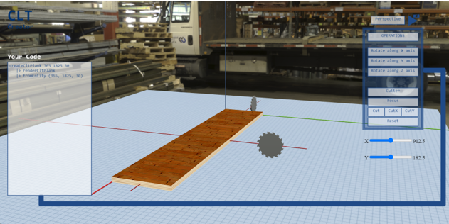

<h1>CLT Creator</h1>

<h2> Check Out This Project at <a href="https://cltcreator.netlify.app">CLTCreator</a> </h2>



**_CLT Creator tool is discussed in the below article_**

<h2>Abstract</h2>

<p>Today, school students are first introduced to geometry and advanced mathematical concepts by plotting a graph and they struggle with 3D concepts since current technologies can either be too difficult to grasp or too simple with only drag-drop functionalities with no focus on the underlying key concepts. This article presents a 3D graphics library and an interactive, educational system for visualization of a 3D environment where planks of Cross Laminated Timber can be manipulated by geometric and mathematical functions to produce a 3D building-like structure. Through this, there is a focus on functions, 3D geometry and other underlying mathematics, as these mathematical concepts are closely linked with the world of computing, specifically in the fields of computer graphics, which will increase students’ confidence as they will be programming in Elm whilst also spreading the idea of sustainable and clean construction.</p>

_The article is yet to be published..._

<h2>To Run this project locally:</h2>

1. Clone this repository's main branch using:
   `git clone https://github.com/An-u-rag/clt-creator.git`

2. Install Elm by navigating to the homepage of [Elm-lang](https://guide.elm-lang.org/install/elm.html)

3. Run the following command(s) for running the project directly from the project root folder:

   ```
   cd clt-creator
   elm reactor
   ```

   Open localhost:8000 on your browser window and navigate to src/Main.elm

<h3>OR</h3>

3. Run the following command(s) for building an index.html or an optimized .js file for the elm project.

```
cd clt-creator

# Build an index.html file of the Mail.elm file
elm make src/Main.elm

# OR Build an optimized JS file to embed in your own HTML document
elm make src/Main.elm --optimize --output=cltcreator.js
```
